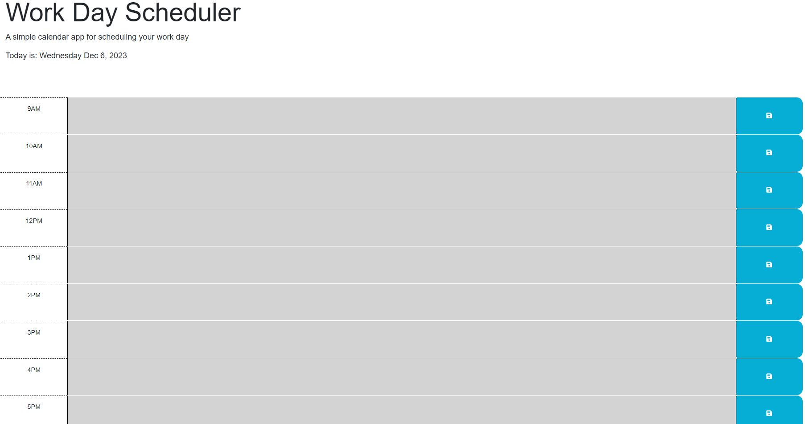

# Work-day-scheduler

## Description

A workday scheduler to keep track of daily tasks during the work day.
This web application uses the Day.js library to track the time of day and tell you what events are in the past or future. The current hour will also be highlighted in red.

dayjs: https://day.js.org

Starter code: https://github.com/coding-boot-camp/crispy-octo-meme

JS Line 31 help provided by TA Casey Miller.

## Link

deploy: https://aalyman42.github.io/Work-day-scheduler

repo: https://github.com/aalyman42/Work-day-scheduler

## Screenshot

